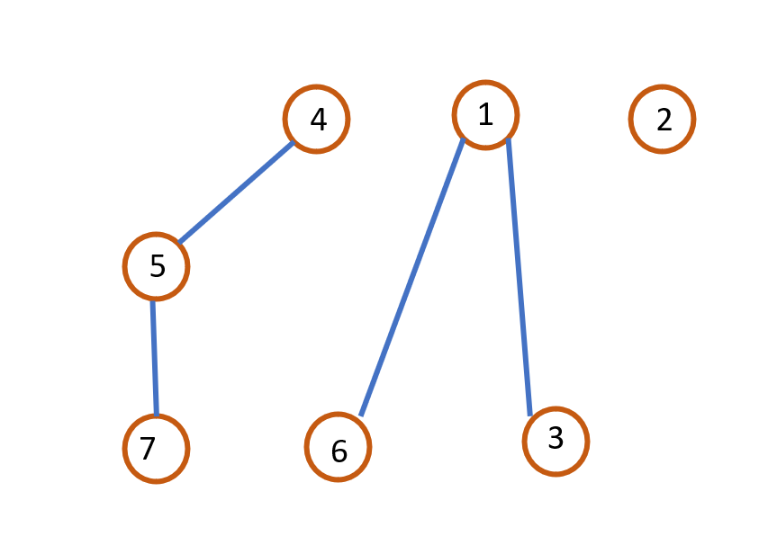
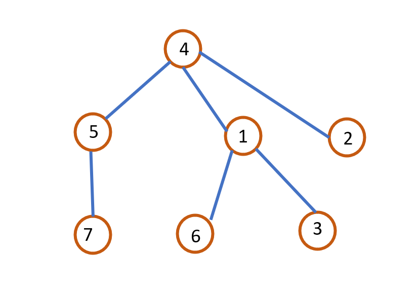
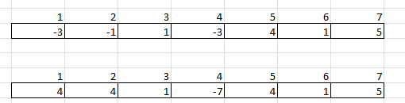
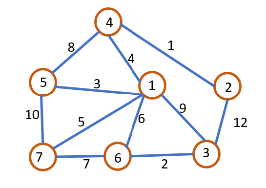

Question 1:

Represent the following as a set.




Answer:

{ <u>4</u>, 5, 7},{<u>1</u>, 6, 3},{<u>2</u>}

Question 2:

Represent the before and after of this operation in a single array and the code to make it happen.




Answer:



```java
public void union (int root1, int root2) 
{
	if (s[root2] < s[root1]) 
		s[root1] = root2;
	else 
	{
		if (s[root1] == s[root2]) 
			s[root1]--;
		s[root2] = root1;
	}
} 
```

Question 3:

Use Kruskal's to find the MST and list the edges.



```
(4, 2), (6,3), (5,1), (4,1), (7,1), (6,1)
```
